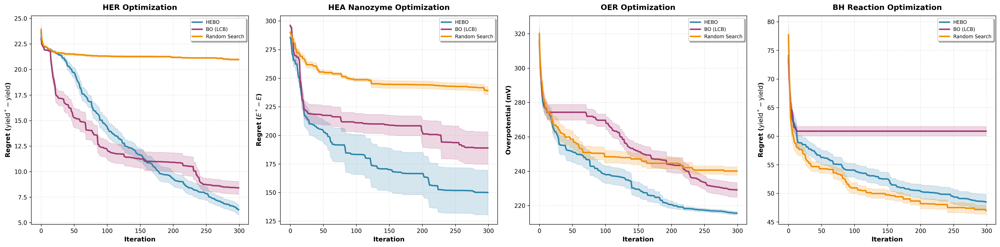

# Installation with `uv`

First, clone the repo [BO-Tutorialfor-Sci](https://github.com/zwyu-ai/BO-Tutorial-for-Sci) and navigate to it.

Then manage dependencies with `uv` as a good practice

```shell
cd $HOME/path/to/BO-Tutorial-for-Sci
uv init
uv venv
source .venv/bin/activate
uv pip install -r requirements.txt
```

# Run

```shell
python3 BO_tutorial.py --optimizer=<all|hebo|bo|rs> --dataset=<all|her|hea|oer|bh>
```

# Results

Note that for the BH results in particular, BO barely runs correctly but produces poor results compared to random
search. HEBO does not work and creates `nan`s which are caught but in order to not crash the run, a random point is
suggested in place of the point that would normally be suggested by HEBO. So this is why the results look similar to
random search for that task, it is because for all seeds of HEBO, most points are actually suggested randomly (so the
final plot can be generated). This can be explained by the extreme high dimensionality of the input features.

On the three other datasets however, HEBO outperforms the other baselines.

